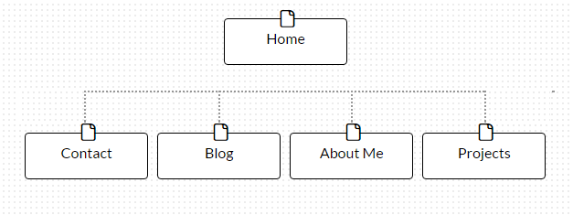

##What are the 6 Phases of Web Design?
	###1. Information Gathering
			Determing what the purpose of the website is and then consider what your goals are.  Are you providing information, selling a product, or promoting something?  Is the goal to share information or sell a product? Next consider who you target audience is and what their age, sex, and interests might be.  What will this target audience be looking for on your website?

	###2. Planning/Site map
			Organize your site by creating a site map, or tree, to better understand where different information will live and how your audience will navigate through the site.

	###3. Design
			Determine what kinds of images, colors, and fonts are appropriate given the purpose of the site and the intended audience.  This would be a good time to wireframe the site.

	###4. Development
			Create your home or index page, followed by a shell.  Shell pages serve as a template for the remaining content and should have all navigation features in place.

	###5. Testing and Delivery
			Using both manual and automated means, test the functionality of your pages to ensure that nav bars, links, forms, and the like all perform as expected.

	###6. Maintenance
			Once the site is live you will need to either update content or provide a way for the client to update content via a CMS over time.

	###NOTE: Let the client view the design as much as possible as you work to pull it together so that you can get feedback early as to what works for them and what doesn't.  Keeping the client involved can save you a lot of time and headache later on.

##What is your site's primary goal or purpose? What kind of content will your site feature?

	The primary purpose of my site will be to sell me.  In other words, the goal is to make myself attractive to potential employers.  Since I will be looking for work as a developer the site should emphasize my skills and knowledge set in web development. However, adding a few personal touchs about my hoobies and other passions, and perhaps some background on the other things I have done in my life will present a more relatable and well-rounded picture to prospective employers.

##What is your target audience's interests and how do you see your site addressing them?

	While my main target audience will be prospective employers, I hope that I can also inspire and teach others who are considering learning about programming.  The blog portion will highlight lessons I have learned and showcase some of my knowledge base as it grows.  Employers are interested in finding people with the right set of skills and the right personality to fit into the culture of their company.  Prospective students will be interested in learning more about the process of becoming a developer as well as learning seom concepts seminal to coding.

##What is the primary "action" the user should take when coming to your site? Do you want them to search for information, contact you, or see your portfolio? It's ok to have several actions at once, or different actions for different kinds of visitors.

	For future employers, I would like them to view my portfolio, read a bit about my thoughts on being a developer, and then contact me.  For those who come to learn something about programming, I want them to read through my blog for advice on coding and on how to tackle the process of teaching yourself something new.

##What are the main things someone should know about design and user experience?

	The biggest take away I have is that user experience is everything.  You could have a great product available on a completely functional website/ web app, but if people don't enjoy the experience, they'll leave and won't come back.  The idea is to give them an enjoyable experience through storytelling so that you can connect with them emotionally.  The trick is that not everyone is the same, and what excites when person might be dull and boring to another.  So, know your target audience and hone your site to engage them.  Design isn't merely about making things look pretty; it is about functionality and creating an experience.  

##What is user experience design and why is it valuable? 

	User experience, or UX, design is about creating a positive experience for your users. It is about storytelling and emotional engagement as well.  UX design is valuable because happy users are less likely to bounce, more apt to buy or invest in your services, and more likely to return to your site in the future.

##Which parts of the challenge did you find tedious?

	All of the reading has been fascinating, but I started to go down a bit of a rabbit hole in researching some outlying links, which got a little tired after a while.
