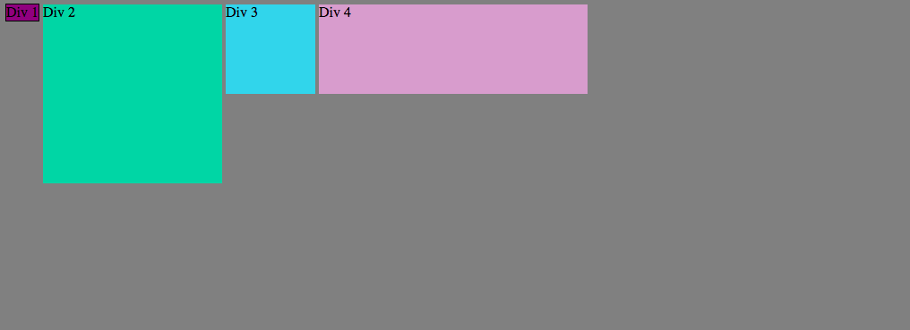
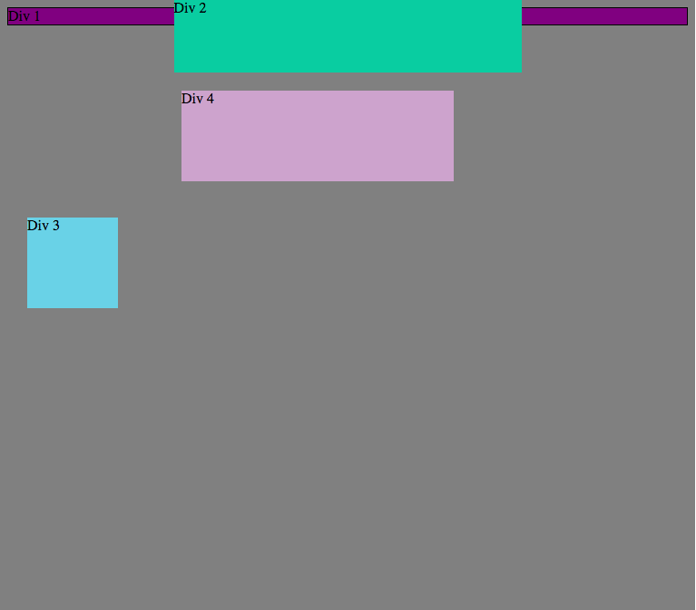
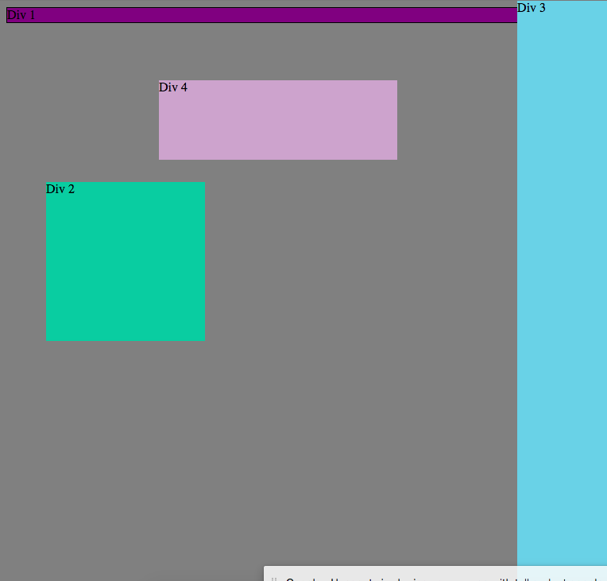
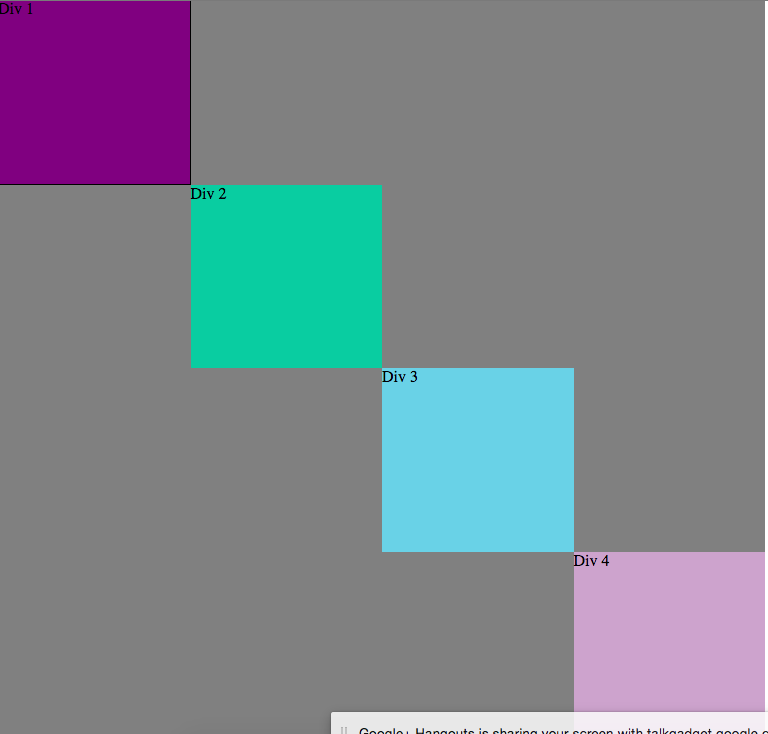

##How can you use Chrome's DevTools inspector to help you format or position elements?

Chrome's DevTools inspector allows you to quickly and easily select elements and toggle on or off various portions of the css to see how it effects the formatting of your page.  It also allows you to add your own new css so that you can experiment with various changes.  And because the response of the output window is instant, you can try many changes in a short period of time, which is an advantage over iterating through your css file and constantly reloading your page in the browser over and over again.

##How can you resize elements on the DOM using CSS?

You can quickly resize elements be changing their width and height attributes.  Using em's or percentages is best because it allows the greatest felxibility between screen sizes and resolutions.

##What are the differences between Absolute, Fixed, Static, and Relative positioning? Which did you find easiest to 
use? Which was most difficult?

###Static
All elements are static by default, which means that they are _not_ positioned in any special way, but rather according to the flow of the page.

###Relative
Elements that are positioned using the relative keyword are placed relative to it normal position.  Of course, what is the elements normal position?  It's normal position is where _static_ would have placed it, or in other words, where it would be by default.  You must use the top, right, bottom, and left properties to set the elements location; without the addition of one or more of these properties, the element will remain where it would be by default.

###Absolute
This is where it gets a little tricky to follow, and you must pay attention to the nearest ancestor of the element in question.  Elements with absolute position are positioned relative to the nearest ancestor rather than being position relative to the viewport as _fixed_ would do.  If an element has no positioned ancestors (i.e. no ancestors *without* default or static positioning) it uses the document body and moves along with the page scrolling.

###Fixed
Fixed allows you to position an element relative to the viewport, which means that it will _always_ appear in that exact position in the viewport no matter what.  Scroll up or down, the fixed element will always stay put. You must use the top, right, bottom, and left properties to position the element where you want it in the viewport.  On another note, a fixed element does not leave a gap in the flow of the page where it normally would have been located.

##What are the differences between Margin, Border, and Padding?

I like to start with thinking about the border, since it is like the fence between margin and padding.  The margin is the outer transparent space around the border.  In other words, it helps to create space _between_ elements.  Padding is the 'white' space between the inside of the border in the actual text or content of the element.  One thing to keep in mind is that regardless of whether you actually draw a border or not, there still exists this theoretical border object which can have transparent space around it (margin) and 'white' space inside of it (padding) that separates the content from the frame of the element.

##What was your impression of this challenge overall? (love, hate, and why?)

This challenge was quick, fun, and easy for me amd my pair!  Chrome DevTools made this a very simple set of tasks to accomplish.  I wish I had done things in order and gone through this challenge before I started setting up the css for the solo challenege, it would have made my life simpler.  I will certainly use Chrome DevTools in the future to help with positioning of elements.

##Screenshots below, in order of each task:

###Change Colors

###Columns

###Row

###Make-Euqidistant

###Squares

###Footer

###Header

###Sidebar

###Creative

